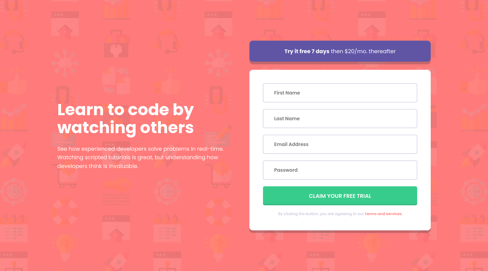

# Frontend Mentor - Intro component with sign up form solution

This is a solution to the [Intro component with sign up form challenge on Frontend Mentor](https://www.frontendmentor.io/challenges/intro-component-with-signup-form-5cf91bd49edda32581d28fd1). Frontend Mentor challenges help you improve your coding skills by building realistic projects. 

## Table of contents

- [Frontend Mentor - Intro component with sign up form solution](#frontend-mentor---intro-component-with-sign-up-form-solution)
  - [Table of contents](#table-of-contents)
  - [Overview](#overview)
    - [The challenge](#the-challenge)
    - [Screenshot](#screenshot)
    - [Links](#links)
  - [My process](#my-process)
    - [Built with](#built-with)
    - [What I learned](#what-i-learned)
    - [Continued development](#continued-development)
    - [Useful resources](#useful-resources)
  - [Author](#author)
  - [Acknowledgments](#acknowledgments)

## Overview

### The challenge

Users should be able to:

- View the optimal layout for the site depending on their device's screen size
- See hover states for all interactive elements on the page
- Receive an error message when the `form` is submitted if:
  - Any `input` field is empty. The message for this error should say *"[Field Name] cannot be empty"*
  - The email address is not formatted correctly (i.e. a correct email address should have this structure: `name@host.tld`). The message for this error should say *"Looks like this is not an email"*

### Screenshot




### Links

- Solution URL: [GitHub](https://github.com/juanhastier/intro-component-with-signup-form)
- Live Site URL: [Intro component with signup form](https://juanhastier.github.io/intro-component-with-signup-form)

## My process

### Built with

- Semantic HTML5 markup
- CSS custom properties
- Flexbox
- CSS Grid
- Mobile-first workflow
- CSS Transitions
- BEM architecture
- Semantic UI
- Accessibility
- From validation

### What I learned

Even though I was already familiar with the technologies used, this project helped me:

- **Reinforce clean coding habits**: Organizing CSS with variables, reusable components, and BEM.
```css
.form__input--error {
  border-color: var(--red-400);
  background: url("./images/icon-error.svg") no-repeat right 20px center / 20px;
}
```
- **Master form validation UX**: Deciding when to show errors (on blur, not while typing) and how to announce them accessibly.
```js
function validateField(input, field, errorSpan, validateFn) {
  const errorMessage = validateFn(input.value, field)
  if (errorMessage) {
    input.classList.add('form__input--error')
    input.setAttribute('aria-invalid', 'true')
    errorSpan.textContent = errorMessage
  } else {
    input.classList.remove('form__input--error')
    input.setAttribute('aria-invalid', 'false')
    errorSpan.textContent = ''
  }
}
```
- **Improve accessibility awareness**: Every input has proper labels, ARIA attributes, and live regions for error messages.
```html
<div class="form__field">
  <label for="email" class="sr-only">Email Address</label>
  <input type="email" id="email" class="form__input" aria-describedby="error-email">
  <div id="error-email" class="form__error" aria-live="polite"></div>
</div>
```
- **Practice mobile-first responsive design**: Adapting the layout from 375px to desktop without breaking the design.
```css
@media (min-width: 1024px) {
  .signup {
    flex-direction: row;
    gap: 32px;
    max-width: 1150px;
  }
}
```

Sometimes the value of a project is not in learning something brand new, but in refining what you already know.

### Continued development

I want to continue refining my skills in the following areas:

- **JavaScript frameworks**: Start learning React to build more dynamic and component-based user interfaces.
- **Advanced form patterns**: Explore more complex validation scenarios, such as cross-field validation and async checks (e.g., email availability).
- **CSS architectures**: Go deeper into scalable patterns like BEM and experiment with utility-first frameworks like Tailwind CSS.
- **Testing**: Learn how to write unit tests for JavaScript validation logic (e.g., with Jest) to ensure code reliability.
- **Backend integration**: Connect frontend forms to a real backend API to handle data persistence and authentication.

### Useful resources

- [MDN Web Docs](https://developer.mozilla.org/) - I really enjoyed studying on MDN, and I will continue to use it in the future.
- [CSS Tricks: CSS Flexbox Layout Guide](https://css-tricks.com/snippets/css/a-guide-to-flexbox/) - This is an amazing article which helped me finally understand flexbox layout. I'd recommend it to anyone still learning this concept.
- [CSS Tricks: CSS Grid Layout Guide](https://css-tricks.com/complete-guide-css-grid-layout/) - This is an amazing article which helped me finally understand grid layout. I'd recommend it to anyone still learning this concept.

## Author

- Frontend Mentor - [@juanhastier](https://www.frontendmentor.io/profile/juanhastier)

## Acknowledgments

- Thanks to **Frontend Mentor** for providing this challenge and the free design files.
- Shout out to the **Frontend Mentor Discord community** for their helpful feedback on form validation patterns.
- Inspired by solutions from other developers, especially those who implemented accessible `aria-live` regions in their forms.
- Special mention to **MDN Web Docs** for their clear documentation on ARIA attributes and form validation.
